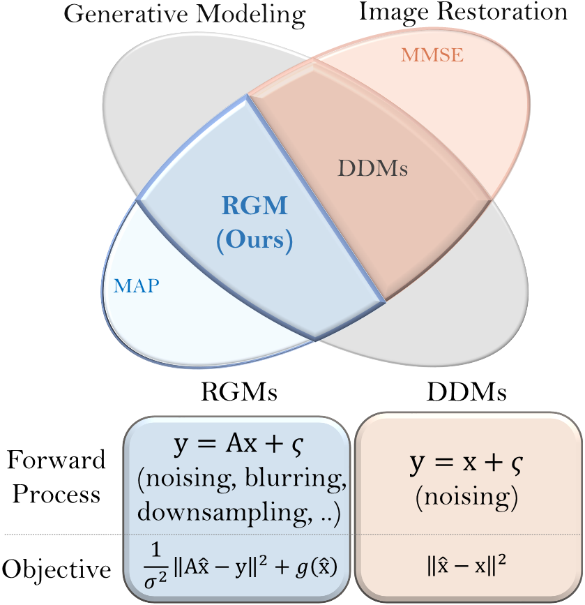

# Restoration-based Generative Model [(ICML 2023)](https://arxiv.org/abs/2303.05456) #
<div align="center">
    
</div>

Inspired by a MAP-based estimation of image restoration, we establish a new flexible framework of generative modeling (RGM) based on the following equation:
$$\mathbb{E} \left[ \frac{\lambda}{2} \lVert \Sigma^{-1} \left( A\cdot G_\theta (y, z) - y \right) \rVert_2^2 + g_\phi \left( G_\theta (y,z) \right) \right].$$
Integrating IR literature allows us to use an alternative objective and diverse forward processes. Specifically, RGM has flexibility in the following two aspects. 
- Flexibility on regularization term $g_\phi$ : Our regularization schem can leverage various methods including GAN structure, MMD, and DSWD.
- Flexibility on $A$ : RGM works with general degradations including noising and down-sampling.

## Training RGM ##
We use the following commands for training RGM.

#### CIFAR-10 ####
We train RGM on CIFAR-10 using 4 32-GB V100 GPU.

RGM-KLD-D
```
python3 train.py --exp rgm-kld-d --num_timesteps 4 --epoch 1000 --lmbda 0.001 --forward_name ddpm 
```
RGM-KLD-SR
```
python3 train.py --exp rgm-kld-sr --num_timesteps 7 --epoch 1300 --lmbda 0.001 --forward_name sr
```
RGM-DSWD-D
```
python3 train.py --exp rgm-dswd-d --lmbda 0.001 --forward_name ddpm --num_timesteps 4 
```

#### CelebA HQ 256 ####
We train RGM on CelebA HQ 256 using 8 32-GB V100 GPUs. 
```
python3 train.py --exp rgm-kld-d --dataset celeba_256 --image_size 256  --num_channels_dae 64 --n_mlp 3 --ch_mult 1 1 2 2 4 4 --lr_d 1e-4 --lr_g 2e-4 --schedule 700 --num_epoch 650 --batch_size 32 --r1_gamma 2. --lazy_reg 10 --lmbda 0.00005 --save_content_every 10 --save_image_every 1 --save_ckpt_every 20
```

#### Restoration Task (SR and Colorization) ####
The commands for restoration tasks can be found in "restore.sh" file.

## Pretrained Checkpoints ##
Pretrained checkpoints on CIFAR-10 (RGM-SR-D) and CelebA HQ 256 (RGM-KLD-D) is available at [Google drive directory](https://drive.google.com/file/d/1S7KpOrWKxknDABfYJ5L9R-7Y16MVbW7q/view?usp=drive_link).


## Bibtex ##
Cite our paper using the following bibtex item:
```
@inproceedings{
choi2023restoration,
title={Restoration based Generative Models},
author={Choi, Jaemoo and Park, Yesom and Kang, Myungjoo},
booktitle={International Conference on Machine Learning},
year={2023}
}
```